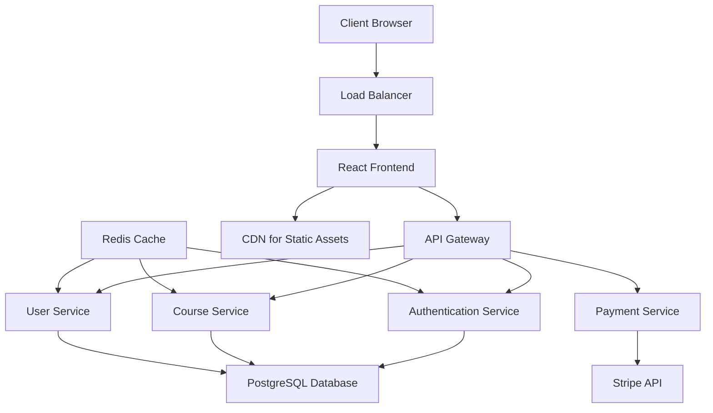

# Design Document

## Overview

The trading education website will be built as a modern, responsive web application using a component-based architecture. The platform will feature a React.js frontend with a Node.js/Express backend, utilizing a PostgreSQL database for data persistence and Redis for caching and session management. The design emphasizes scalability, security, and user experience optimization.

## Architecture

### High-Level Architecture



### Technology Stack

**Frontend:**
- Angular 17+ with TypeScript
- Angular Material for UI components
- RxJS for reactive programming
- Angular Forms for form handling
- Angular Router for navigation

**Backend:**
- Java 17+ with Spring Boot 3.x
- Spring Security for authentication and authorization
- Spring Data JPA for database operations
- Spring Web for REST API development
- Maven for dependency management

**Database:**
- PostgreSQL for primary data storage
- Redis for session management and caching
- Video Storage Options:
  - AWS S3 (pay-per-use: ~$0.023/GB/month + transfer costs)
  - Local file system (free but not scalable)
  - Cloudinary (free tier: 25GB storage, 25GB bandwidth/month)
  - YouTube/Vimeo embedding (free but less control)

**Infrastructure:**
- Docker for containerization
- AWS/Vercel for deployment
- Stripe for payment processing
- SendGrid for email services

## Components and Interfaces

### Frontend Components

#### Core Layout Components
- **HeaderComponent**: Navigation, user menu, search functionality
- **FooterComponent**: Links, contact information, legal pages
- **SidebarComponent**: Course navigation, progress indicators
- **LayoutComponent**: Responsive wrapper with mobile-first design

#### Page Components
- **HomeComponent**: Hero section, featured courses, testimonials
- **CourseCatalogComponent**: Course grid with filtering and search
- **CourseDetailComponent**: Course information, enrollment, reviews
- **DashboardComponent**: Student progress, enrolled courses, notifications
- **VideoPlayerComponent**: Custom video player with progress tracking
- **ForumComponent**: Discussion threads, posting, moderation

#### Form Components
- **LoginComponent**: Email/password authentication with reactive forms
- **RegisterComponent**: User registration with validation
- **PaymentComponent**: Stripe integration for course purchases
- **ProfileComponent**: User profile management

### Backend API Endpoints

#### Authentication Controller
```
POST /api/auth/register
POST /api/auth/login
POST /api/auth/logout
POST /api/auth/refresh
POST /api/auth/forgot-password
POST /api/auth/reset-password
```

#### User Controller
```
GET /api/users/profile
PUT /api/users/profile
GET /api/users/dashboard
GET /api/users/progress/{courseId}
```

#### Course Controller
```
GET /api/courses
GET /api/courses/{id}
POST /api/courses (admin only)
PUT /api/courses/{id} (admin only)
DELETE /api/courses/{id} (admin only)
GET /api/courses/{id}/lessons
POST /api/courses/{id}/enroll
```

#### Payment Controller
```
POST /api/payments/create-intent
POST /api/payments/confirm
GET /api/payments/history
```

## Data Models

### User Entity
```java
@Entity
@Table(name = "users")
public class User {
    @Id
    @GeneratedValue(strategy = GenerationType.UUID)
    private String id;
    
    @Column(unique = true, nullable = false)
    private String email;
    
    @Column(nullable = false)
    private String password; // hashed
    
    @Column(nullable = false)
    private String firstName;
    
    @Column(nullable = false)
    private String lastName;
    
    @Enumerated(EnumType.STRING)
    private Role role; // STUDENT, INSTRUCTOR, ADMIN
    
    private String profileImage;
    
    @CreationTimestamp
    private LocalDateTime createdAt;
    
    @UpdateTimestamp
    private LocalDateTime updatedAt;
    
    private boolean isVerified;
    
    @Enumerated(EnumType.STRING)
    private SubscriptionStatus subscriptionStatus; // ACTIVE, INACTIVE, TRIAL
}
```

### Course Entity
```java
@Entity
@Table(name = "courses")
public class Course {
    @Id
    @GeneratedValue(strategy = GenerationType.UUID)
    private String id;
    
    @Column(nullable = false)
    private String title;
    
    @Column(columnDefinition = "TEXT")
    private String description;
    
    private String shortDescription;
    
    @Column(nullable = false)
    private BigDecimal price;
    
    private String currency;
    
    @Enumerated(EnumType.STRING)
    private Difficulty difficulty; // BEGINNER, INTERMEDIATE, ADVANCED
    
    private Integer duration; // in hours
    
    @ManyToOne
    @JoinColumn(name = "instructor_id")
    private User instructor;
    
    private String thumbnailUrl;
    private String previewVideoUrl;
    private String category;
    
    @ElementCollection
    private List<String> tags;
    
    private boolean isPublished;
    
    @CreationTimestamp
    private LocalDateTime createdAt;
    
    @UpdateTimestamp
    private LocalDateTime updatedAt;
    
    private Integer enrollmentCount;
    private Double rating;
}
```

### Lesson Entity
```java
@Entity
@Table(name = "lessons")
public class Lesson {
    @Id
    @GeneratedValue(strategy = GenerationType.UUID)
    private String id;
    
    @ManyToOne
    @JoinColumn(name = "course_id")
    private Course course;
    
    @Column(nullable = false)
    private String title;
    
    @Column(columnDefinition = "TEXT")
    private String description;
    
    private String videoUrl;
    private Integer duration; // in seconds
    private Integer orderIndex;
    
    @OneToMany(mappedBy = "lesson", cascade = CascadeType.ALL)
    private List<Resource> resources;
    
    private boolean isPreview;
    
    @CreationTimestamp
    private LocalDateTime createdAt;
    
    @UpdateTimestamp
    private LocalDateTime updatedAt;
}
```

### Enrollment Entity
```java
@Entity
@Table(name = "enrollments")
public class Enrollment {
    @Id
    @GeneratedValue(strategy = GenerationType.UUID)
    private String id;
    
    @ManyToOne
    @JoinColumn(name = "user_id")
    private User user;
    
    @ManyToOne
    @JoinColumn(name = "course_id")
    private Course course;
    
    @CreationTimestamp
    private LocalDateTime enrolledAt;
    
    private LocalDateTime completedAt;
    private Integer progress; // percentage
    private LocalDateTime lastAccessedAt;
    private boolean certificateIssued;
}
```

### Progress Entity
```java
@Entity
@Table(name = "progress")
public class Progress {
    @Id
    @GeneratedValue(strategy = GenerationType.UUID)
    private String id;
    
    @ManyToOne
    @JoinColumn(name = "user_id")
    private User user;
    
    @ManyToOne
    @JoinColumn(name = "lesson_id")
    private Lesson lesson;
    
    @ManyToOne
    @JoinColumn(name = "course_id")
    private Course course;
    
    private boolean completed;
    private Integer watchTime; // in seconds
    private LocalDateTime completedAt;
    
    @Column(columnDefinition = "TEXT")
    private String notes;
}
```

## Error Handling

### Frontend Error Handling
- Global error boundary for React components
- Toast notifications for user-facing errors
- Form validation with real-time feedback
- Network error handling with retry mechanisms
- Loading states and skeleton screens

### Backend Error Handling
- Centralized error middleware
- Structured error responses with consistent format
- Logging with different severity levels
- Rate limiting to prevent abuse
- Input validation and sanitization

### Error Response Format
```typescript
interface ErrorResponse {
  success: false;
  error: {
    code: string;
    message: string;
    details?: any;
  };
  timestamp: string;
  path: string;
}
```

## Testing Strategy

### Frontend Testing
- **Unit Tests**: Jasmine and Karma for Angular components and services
- **Integration Tests**: Angular Testing Utilities for component interactions
- **E2E Tests**: Protractor or Cypress for critical user journeys
- **Visual Regression**: Chromatic for UI consistency
- **Accessibility**: axe-core for WCAG compliance

### Backend Testing
- **Unit Tests**: JUnit 5 and Mockito for individual methods and classes
- **Integration Tests**: Spring Boot Test for API endpoint testing
- **Database Tests**: TestContainers with H2 in-memory database
- **Security Tests**: Spring Security Test for authentication flows
- **Performance Tests**: JMeter for load testing

### Test Coverage Goals
- Minimum 80% code coverage for critical paths
- 100% coverage for authentication and payment flows
- Automated testing in CI/CD pipeline
- Manual testing for UX and accessibility

### Testing Environment
- Separate test database with automated cleanup
- Mock external services (Stripe, SendGrid, AWS)
- Containerized testing environment
- Automated test runs on pull requests

## Security Considerations

### Authentication & Authorization
- JWT tokens with Spring Security implementation
- Refresh token rotation with Redis storage
- Role-based access control using Spring Security annotations
- Multi-factor authentication for admin accounts
- BCrypt password encoding

### Data Protection
- HTTPS enforcement
- Password hashing with bcrypt
- Input sanitization and validation
- SQL injection prevention with parameterized queries
- XSS protection with Content Security Policy

### Payment Security
- PCI DSS compliance through Stripe
- No storage of payment card data
- Secure webhook handling
- Transaction logging and monitoring

### Infrastructure Security
- Environment variable management
- Database connection encryption
- Regular security updates
- Monitoring and alerting for suspicious activity

## Performance Optimization

### Frontend Performance
- Code splitting and lazy loading
- Image optimization and WebP format
- CDN for static assets
- Service worker for offline functionality
- Bundle size optimization

### Backend Performance
- Database query optimization
- Redis caching for frequently accessed data
- Connection pooling
- API response compression
- Rate limiting and throttling

### Video Delivery Options

#### Option 1: AWS S3 + CloudFront (Scalable, Professional)
- Cost: ~$0.023/GB storage + $0.085/GB transfer
- Adaptive bitrate streaming
- Global CDN distribution
- Full control over video security and access

#### Option 2: Cloudinary (Cost-Effective for Small Scale)
- Free tier: 25GB storage, 25GB bandwidth/month
- Automatic video optimization and compression
- Built-in CDN and streaming capabilities
- Easy integration with Spring Boot

#### Option 3: Local File System (Development/MVP)
- Free storage on your server
- No external dependencies
- Limited scalability and no CDN
- Suitable for initial development and testing

#### Option 4: YouTube/Vimeo Embedding (Lowest Cost)
- Free video hosting
- Excellent streaming performance
- Less control over branding and ads
- Suitable for public educational content

## Scalability Considerations

### Horizontal Scaling
- Stateless application design
- Load balancer configuration
- Database read replicas
- Microservices architecture preparation

### Caching Strategy
- Redis for session and API response caching
- Browser caching for static assets
- Database query result caching
- CDN caching for global content delivery

### Monitoring and Analytics
- Application performance monitoring
- User behavior analytics
- Error tracking and alerting
- Database performance monitoring